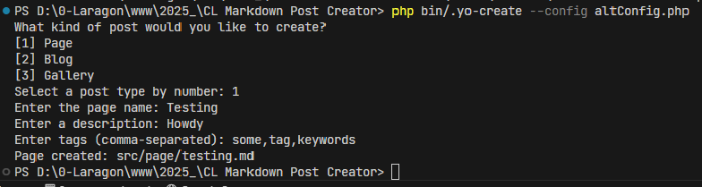
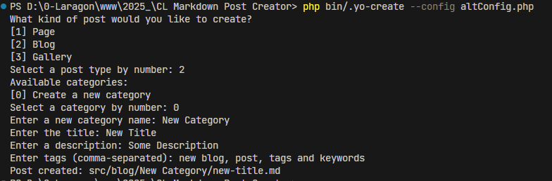
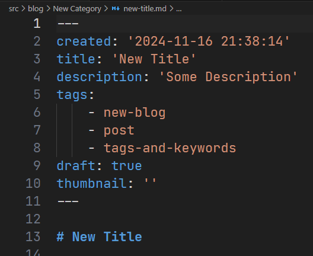

# Command line Markdown Post Creator
A simple way to create a Markdown blog, page, or gallery post in markdown format with the yaml frontmatter, and a basic start for your next new post.

## Create a new blog, page, or gallery
> I will will need to work on the gallery some more

## Default Settings:
```php
$config = [
		'timezone' => 'EST',
		'blogDirectory' => 'content/blog',
		'pageDirectory' => 'content/page',
		'galleryDirectory' => 'content/gallery',
	];
```

```bash
php .yo-create
```
## To Specify Your Own Settings

```bash
php .yo-create --config altConfig.php
```

## Frontmatter Example:
```yaml
created: 'YYY-MM-DD HH:MM:SS'
title: 'The Title'
description: 'Some description of the page. Used for meta information.'
tags:
    - multiple
    - tags
    - like
    - this
draft: true
thumbnail: ''
```
### Creating a New Page

### Creating a New Blog Post

### Created Markdown File

